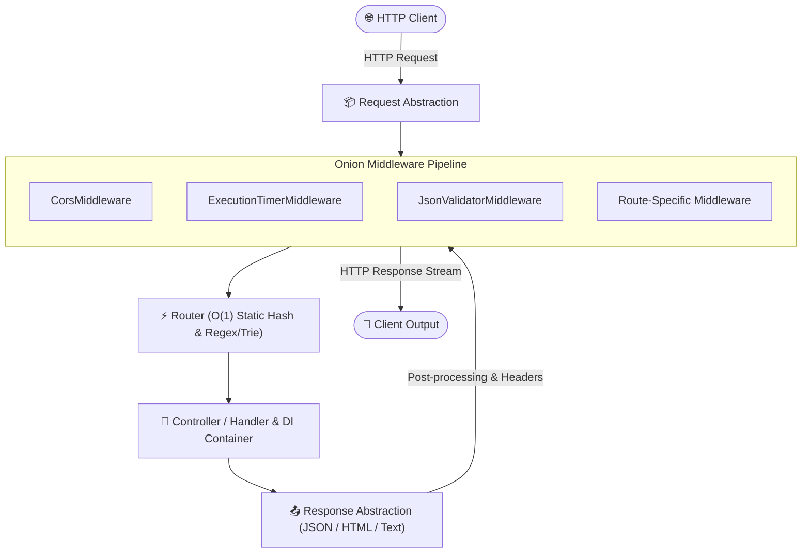

[🇸🇦 العربية](README.ar.md) | [🇬🇧 English](README.md)

# ⚡ eidcloud-micro

> **Topics:** `eidcloud` `php-framework` `microframework` `zero-dependency` `high-performance` `router` `rest-api`

[](https://github.com/shadialhasan/eidcloud-micro/releases)
[](https://www.php.net/)
[](LICENSE)
[](https://colab.research.google.com/github/shadialhasan/eidcloud-micro/blob/main/notebooks/quickstart.ipynb)

**eidcloud-micro** is an ultra-fast, zero-dependency PHP 8.2+ micro-framework with a sub-100KB footprint, engineered specifically for high-concurrency microservices, lightweight REST APIs, edge workers, and CLI tooling.

---

## 🏛 Architecture Overview



---

## 🚀 Key Capabilities

- **Zero External Dependencies**: Pure PHP 8.2+ with 0 composer packages required in production or testing.
- **Sub-100KB Footprint**: The entire framework source and runtime weigh less than 90KB.
- **High-Speed Hybrid Router**:
  - $O(1)$ instant hash lookup for static routes (`/`, `/health`, `/api/users`).
  - Dynamic regex parameter compilation with custom regex constraints (`/users/{id:[0-9]+}`).
  - Nested route grouping (`$app->group('/api/v1', ...)`).
  - Built-in 404 (Not Found) and RFC-compliant 405 (Method Not Allowed) with `Allow` header detection.
- **Onion Middleware Pipeline**:
  - Classic bidirectional middleware wrapping (`$response = $next($request)`).
  - Built-in `CorsMiddleware`, `ExecutionTimerMiddleware` (`X-Response-Time`), and `JsonValidatorMiddleware`.
  - Route-specific middleware attachment (`$app->get('/admin', ...)->add($auth)`).
- **Dependency Injection Container**:
  - Lightweight PSR-11 compatible service locator and container.
  - Singleton and factory bindings.
  - Automatic method and constructor auto-wiring via PHP Reflection.
- **Request & Response Abstractions**:
  - Immutable request wrapping with automatic JSON decoding, case-insensitive headers, query string parser, route parameters, and client IP resolution.
  - Fluent response builder (`Response::json()`, `Response::text()`, `Response::html()`, `Response::redirect()`, `Response::empty()`).
- **Integrated CLI Tool**:
  - Development web server launcher (`serve`).
  - High-concurrency benchmark runner (`benchmark`).

---

## 📥 Installation & Setup

### Via Composer
```bash
composer require eidcloud/micro
```

### Standalone (Zero Composer Requirement)
Because **eidcloud-micro** has zero external dependencies, you can simply clone or copy the repository and include the built-in autoloader:

```php
require_once __DIR__ . '/src/autoload.php';
```

---

## 💻 CLI Executable Tool

The framework includes a standalone CLI binary located at `bin/eidcloud-micro`:

```bash
php bin/eidcloud-micro --help
```

### 1. Development Server
Start the built-in development server with custom host, port, and document root:
```bash
# Start server on default 127.0.0.1:8080
php bin/eidcloud-micro serve

# Custom port and host
php bin/eidcloud-micro serve --port=9000 --host=0.0.0.0 --public=public
```

### 2. High-Concurrency Benchmark Runner
Benchmark any endpoint with concurrent requests and latency breakdown:
```bash
# Execute 1,000 requests at 20 concurrency against health check
php bin/eidcloud-micro benchmark --requests=1000 --concurrency=20 --url=http://127.0.0.1:8080/health

# Benchmark a REST API endpoint
php bin/eidcloud-micro benchmark --requests=500 --concurrency=10 --url=http://127.0.0.1:8080/api/users
```

**Benchmark Output Sample:**
```text
BENCHMARK RESULTS:
  Completed Requests : 1,000 / 1000
  Successful (HTTP)  : 1,000
  Failed / Errors    : 0
  Total Time Taken   : 0.1824 seconds
  Requests / Second  : 5,482.45 req/s
  Data Throughput    : 1,420.12 KB/s

LATENCY DISTRIBUTION (ms):
  Min    :     0.18 ms
  Avg    :     1.82 ms
  Median :     1.65 ms
  95%    :     3.12 ms
  99%    :     4.50 ms
  Max    :     6.21 ms
```

---

## 🛠 PHP API Usage

### 1. Minimal Microservice
```php
<?php

declare(strict_types=1);

require_once __DIR__ . '/src/autoload.php';

use EidCloud\Micro\App;
use EidCloud\Micro\Request;

$app = App::create();

// Global Middlewares
$app->enableCors();
$app->enableTimer();

// Basic Routes
$app->get('/', fn() => ['service' => 'auth-microservice', 'status' => 'healthy']);

$app->get('/health', function () {
    return [
        'status' => 'pass',
        'timestamp' => time(),
        'memory_peak' => memory_get_peak_usage(true),
    ];
});

$app->run();
```

### 2. Route Parameters & Custom Regex
```php
// Dynamic parameter (/users/123)
$app->get('/users/{id}', function (string $id) {
    return ['user_id' => $id];
});

// Custom regex parameter constraint (/orders/SYR-2026)
$app->get('/orders/{code:[A-Z]{3}-\d+}', function (string $code) {
    return ['order_code' => $code];
});
```

### 3. Route Groups & Prefixing
```php
$app->group('/api/v1', function ($router) {
    $router->get('/catalog', fn() => ['items' => ['item1', 'item2']]);
    
    $router->group('/admin', function ($adminRouter) {
        $adminRouter->get('/stats', fn() => ['uptime' => 99.98]);
    });
});
```

### 4. Route-Specific Middleware
```php
$authMiddleware = function (Request $req, callable $next) {
    if ($req->getHeader('Authorization') !== 'Bearer secret-token') {
        return EidCloud\Micro\Response::json(['error' => 'Unauthorized'], 401);
    }
    return $next($req);
};

$app->get('/dashboard', fn() => ['metrics' => 'confidential'])
    ->add($authMiddleware);
```

### 5. Dependency Injection Container
```php
$container = $app->getContainer();

// Register a singleton database or cache client
$container->singleton(DatabaseConnection::class, function () {
    return new DatabaseConnection('sqlite::memory:');
});

// Auto-wired controller action
$app->get('/products', function (DatabaseConnection $db, Request $request) {
    return $db->query("SELECT * FROM products LIMIT " . (int)$request->query('limit', 10));
});
```

---

## 🧪 Running Tests

The test suite requires zero external dependencies and runs directly via the built-in test runner:

```bash
php tests/run_tests.php
```

All 17 core assertions test static routing, parameter extraction, custom regex patterns, 404/405 errors, request/response models, onion middleware pipelines, CORS, execution timing, JSON validators, and dependency injection auto-wiring.

---

## 👤 Author & Maintainer

**Eng. MHD. Shadi AL-Hasan**  
- **Role:** Executive CTO & Enterprise Solutions Architect  
- **Email:** [mhd.shadi.alhasan@gmail.com](mailto:mhd.shadi.alhasan@gmail.com)  
- **Phone / WhatsApp:** [+963934005922](tel:+963934005922)  
- **Location:** Damascus, Syria  
- **GitHub:** [shadialhasan](https://github.com/shadialhasan)  

---

## 📄 License

This project is licensed under the MIT License - see the [LICENSE](LICENSE) file for details.  
Copyright (c) 2026 **MHD. Shadi AL-Hasan**. All rights reserved.
